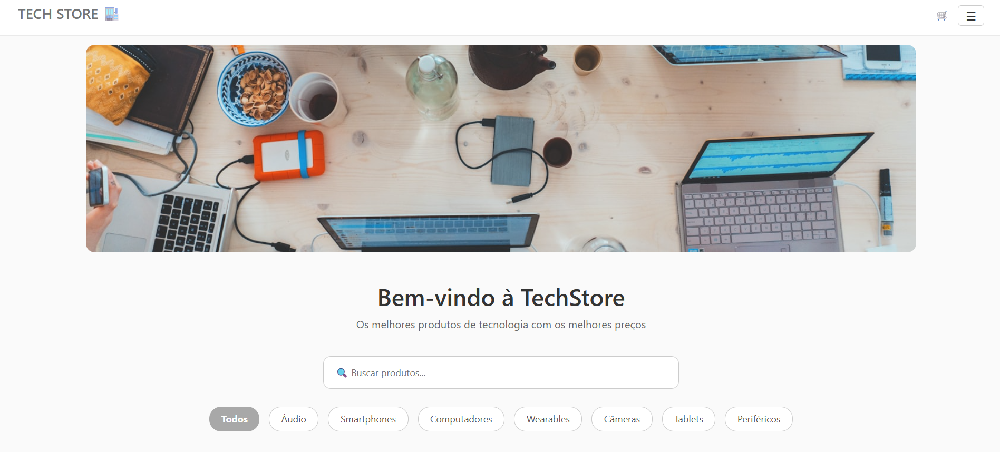
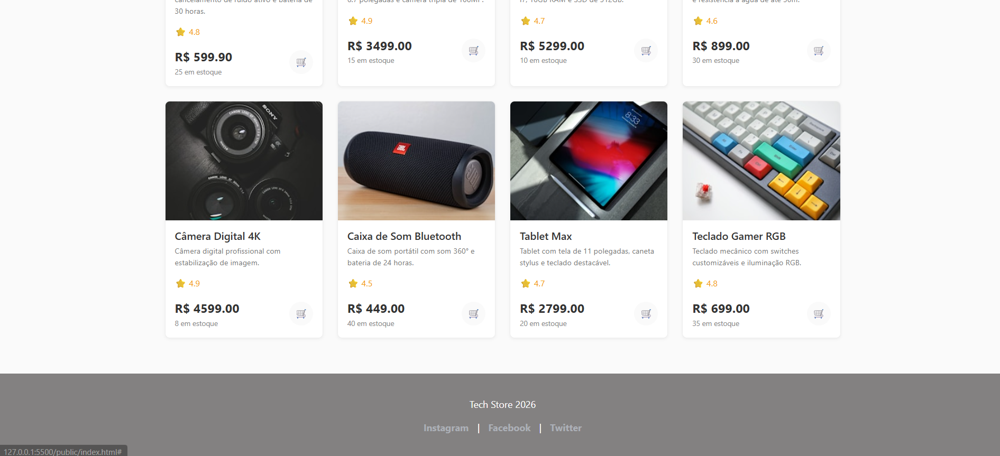
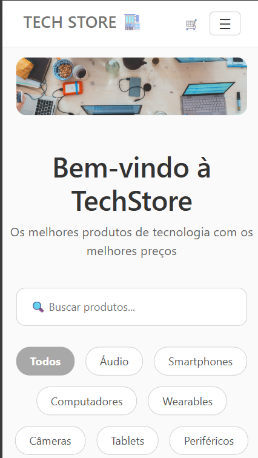
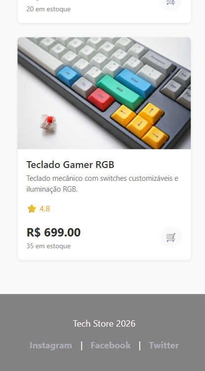

# Trabalho Prático - Semana 6

Nessa atividade, como sempre, vamos evoluir o que foi feito na semana anterior. Fique atento para fazer o projeto da semana anterior e dar sequência nessa jornada.

No trabalho dessa semana vamos alterar o projeto para que a responsividade da home-page seja feita, agora, com o framework Bootstrap.

**IMPORTANTE 1:** Você deve alterar apenas os arquivos **`README.md`**, **`index.html`** e **`styles.css`**, podendo incluir outros arquivos como imagens na pasta **`images`**, caso necessário. Deixe todos os demais arquivos e pastas desse repositório inalterados. **PRESTE MUITA ATENÇÃO NISSO.**

## Informações Gerais

- Nome: Sávio José Salomão Ferreira da Silva
- Matricula: 906957
- Proposta de projeto escolhida: E-commerce
- Breve descrição sobre seu projeto: Projeto focado em uma interface moderna e funcional, desenvolvido com HTML5, CSS3 e Bootstrap 5. A plataforma conta com catálogo de produtos, sistema de filtros e adaptação completa para dispositivos móveis.

## Print da versão responsiva com Bootstrap [DESKTOP]

## Print da versão responsiva com Bootstrap [MOBILE] (*)

(*) Utilize as ferramentas do desenvolvedor do seu navegador para colocar no modo reponsivo, escolha um celular qualquer e recarregue a página antes de tirar o print. 